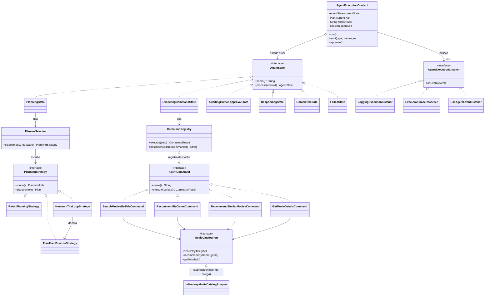
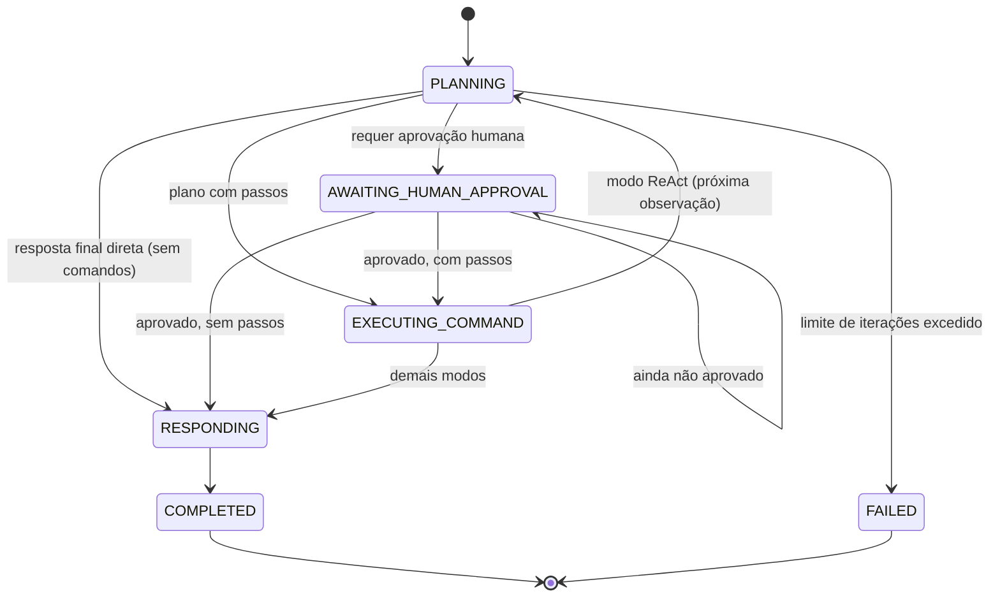
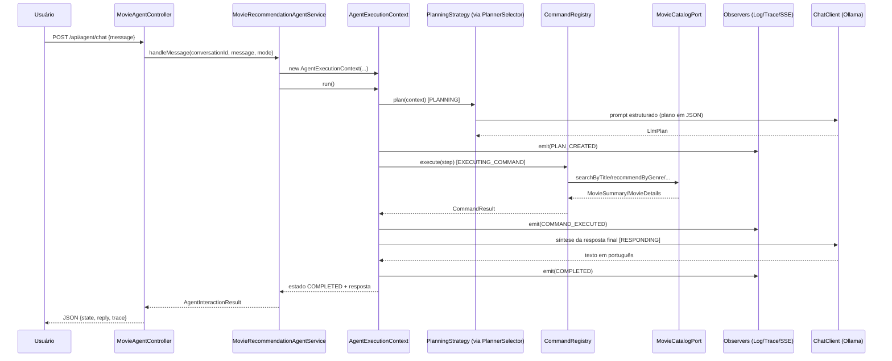
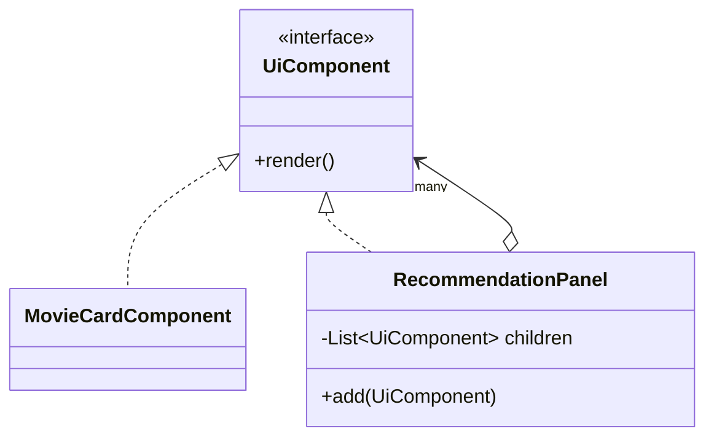

# Arquitetura do CineMindAI

Agente de recomendação de filmes construído com **Spring AI** + **Ollama** (modelo local,
100% open source), demonstrando os padrões de projeto **State**, **Command**, **Strategy** e
**Observer**. A consulta real a dados/API de filmes é responsabilidade de outro integrante do
grupo; este módulo expõe um ponto de integração limpo (`MovieCatalogPort`) para isso.

## Visão geral

O usuário manda uma mensagem (ex.: *"recomende filmes de ficção científica parecidos com
Interestelar"*). O `MovieAgentController` cria um `AgentExecutionContext` para aquela conversa
e chama `run()`. A partir daí:

1. **STATE** conduz o ciclo de vida da execução (`PLANNING` → `EXECUTING_COMMAND` →
   `RESPONDING` → `COMPLETED`, com desvio opcional para `AWAITING_HUMAN_APPROVAL`).
2. Em `PLANNING`, uma **STRATEGY** de planejamento (ReAct, Plan-then-Execute ou
   Human-in-the-loop) decide o que fazer, usando o `ChatClient` (Ollama).
3. Em `EXECUTING_COMMAND`, cada ação decidida pela estratégia é despachada como um
   **COMMAND** (buscar filme, recomendar por gênero, etc.), via `CommandRegistry`.
4. A cada mudança de estado, plano criado ou comando executado, o contexto notifica seus
   **OBSERVERS** (log, trace/dashboard, SSE em tempo real).
5. Em `RESPONDING`, o `ChatClient` sintetiza a resposta final a partir dos resultados dos
   comandos (quando a estratégia ainda não tiver gerado uma resposta direta).

Por que cada padrão foi escolhido:

| Padrão | Onde | Por quê |
|---|---|---|
| **State** | `agent.state.*` + `AgentExecutionContext` | Torna o ciclo de vida do agente explícito e impede estados ilegais (ex.: executar um comando antes de existir um plano, ou responder antes de aguardar aprovação humana). |
| **Command** | `agent.command.*` | Cada ação do agente (busca, recomendação, detalhes) é um objeto autocontido, permitindo despacho uniforme por nome, histórico de execução e fácil adição de novos comandos sem tocar no restante do agente. |
| **Strategy** | `agent.strategy.*` | O modo de planejamento (ReAct / Plan-then-Execute / Human-in-the-loop) é intercambiável em tempo de execução, escolhido por `PlannerSelector` conforme a complexidade do pedido, sem alterar o runtime. |
| **Observer** | `agent.observer.*` | O `AgentExecutionContext` (Subject) notifica múltiplos ouvintes independentes a cada evento relevante, viabilizando logging, uma trace consultável (dashboard) e um stream SSE em tempo real, sem acoplar essas preocupações ao core do agente. |

Outros pontos do enunciado, já cobertos nativamente pelo Spring/Spring AI (sem reinventar):

- **Dependency Injection**: todos os componentes (`AgentCommand`s, `PlanningStrategy`s,
  `AgentExecutionListener`s, o `MovieCatalogPort`) são beans Spring, descobertos
  automaticamente via injeção de `List<Interface>` — adicionar um novo comando, estratégia
  ou observer é só criar um novo `@Component`.
- **Chain of Responsibility (Advisors)**: o `ChatClient` é configurado em
  `config/ChatClientConfig.java` com `MessageChatMemoryAdvisor` (memória de conversa) e
  `SimpleLoggerAdvisor` (logging), que é a cadeia de advisors nativa do Spring AI.

## Diagrama de classes

## Diagrama de estados (padrão State)

## Diagrama de sequência (pedido típico)

## Onde o Composite se encaixaria (GUI — fora deste módulo)

O padrão **Composite** não é implementado neste back-end (é responsabilidade de quem
construir a interface gráfica), mas o encaixe natural seria:

`MovieCardComponent` (leaf) representa um cartão de filme; `RecommendationPanel` (composite)
agrupa vários cartões (ou até outros painéis, ex.: seções "Recomendados" / "Parecidos com X")
tratando-os de forma uniforme através da interface `UiComponent`.

## Ponto de integração para dados/API (outro integrante)

`movie/MovieCatalogPort.java` é o contrato que a consulta real de dados/API de filmes deve
implementar (ex.: cliente TMDB/OMDb, ou uma consulta a banco de dados). Hoje o bean ativo é
`InMemoryMovieCatalogAdapter`, um stub com ~10 filmes fixos, apenas para permitir rodar o
agente de ponta a ponta. Basta o colega criar uma nova implementação de `MovieCatalogPort`
anotada com `@Component` (e remover/desabilitar a stub) que os comandos (`agent.command.*`)
passam a usar dados reais automaticamente — nenhuma outra classe precisa mudar.

## API REST exposta

| Método | Rota | Descrição |
|---|---|---|
| `POST` | `/api/agent/chat` | Envia uma mensagem do usuário; inicia ou continua uma conversa. |
| `POST` | `/api/agent/chat/{conversationId}/approve` | Aprova um plano pendente (fluxo Human-in-the-loop). |
| `GET` | `/api/agent/chat/{conversationId}/events` | Stream SSE com a trace de execução em tempo real. |

Veja exemplos de uso em [`../README.md`](../README.md).
